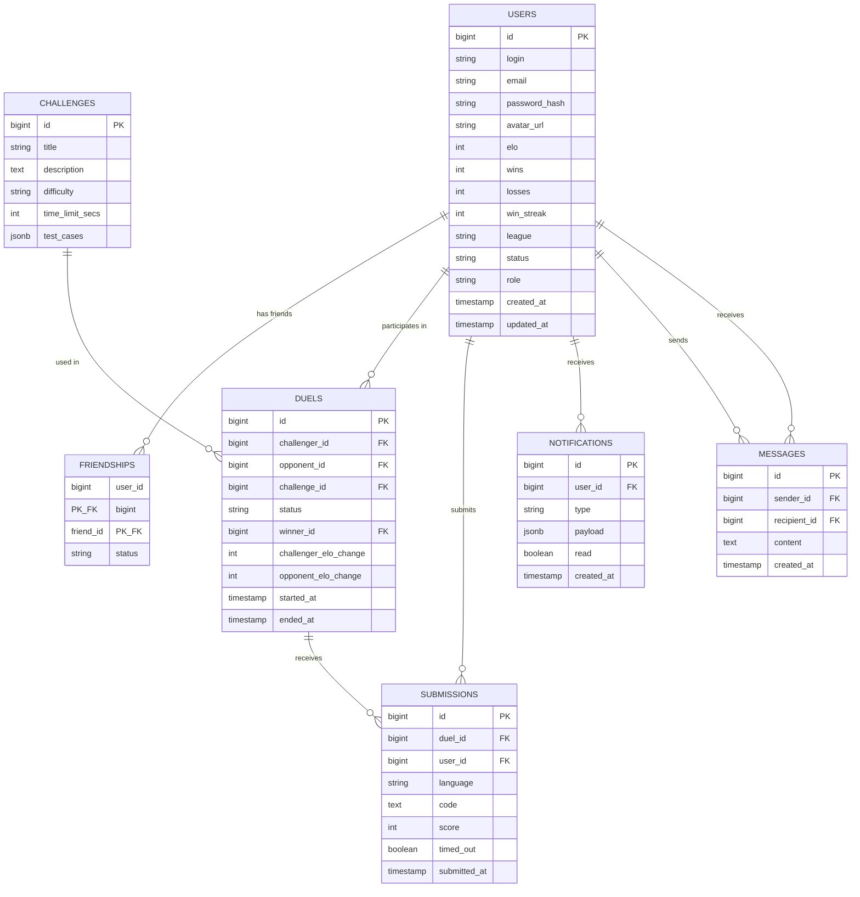

*This project has been created as part of the 42 curriculum by tjorge-l, tborges-, strodrig, hepereir.*

---

# Code Arena

**Code Arena** is a competitive programming platform where players engage in real-time PvP code duels. Inspired by platforms like Codewars and LeetCode — combined with the competitive ladder systems of games like League of Legends — Code Arena pairs opponents of similar skill, presents them with identical coding challenges, and determines a winner based on correctness, speed, and code quality. An Elo-based ranking system drives progression through leagues from Bronze to Legend.

## Table of Contents

- [Description](#description)
- [Instructions](#instructions)
- [Team Information](#team-information)
- [Project Management](#project-management)
- [Technical Stack](#technical-stack)
- [Database Schema](#database-schema)
- [Features List](#features-list)
- [Modules](#modules)
- [Individual Contributions](#individual-contributions)
- [Resources](#resources)
- [Known Limitations](#known-limitations)
- [License](#license)

---

## Description

### Overview

Code Arena is a full-stack web application built for the **ft_transcendence** project at 42. It transforms the traditional "Pong game" concept into a competitive coding platform where two remote players duel in real time to solve programming challenges.

Players register, join a ranked matchmaking queue, get paired with an opponent of similar Elo rating, and compete head-to-head in a timed code duel. Each player receives the same challenge and writes their solution in an in-browser Monaco code editor. Submissions are executed in a secure, sandboxed environment powered by Judge0, and the winner is determined by a composite scoring formula that weighs correctness, submission time, performance, and code quality.

### Key Features

- **Real-Time PvP Code Duels** — Two players compete simultaneously with live status updates via WebSockets.
- **Elo-Based Matchmaking** — Redis-backed ranked queue pairs opponents within a similar skill range (±200 Elo), with progressive range expansion on timeout.
- **In-Browser Code Editor** — Monaco Editor (the engine behind VS Code) with syntax highlighting and full editing capabilities.
- **Sandboxed Code Execution** — User code runs in isolated Judge0 containers with strict CPU, memory, network, and filesystem limits.
- **League & Ranking System** — Five leagues (Bronze, Silver, Gold, Master, Legend) with LP gain/loss based on opponent Elo differential and win streaks.
- **Real-Time Chat** — Direct messaging between users via WebSocket (STOMP/SockJS).
- **Friend System** — Send, accept, and manage friend requests with online status visibility.
- **Notification System** — Real-time notifications for duel results, friend requests, and system events.
- **Gamification** — Achievements, badges, and win streak tracking to reward player progression.
- **User Profiles** — Customizable profiles with avatar upload, match history, and detailed statistics.
- **Challenge Bank** — Curated set of challenges across four difficulty tiers (Easy, Medium, Hard, Insane) with JSONB-stored test cases.

---

## Instructions

### Prerequisites

Ensure the following software is installed on your system:

| Software         | Minimum Version | Notes                                  |
|------------------|-----------------|----------------------------------------|
| **Docker**       | 20.10+          | Required for containerized deployment  |
| **Docker Compose** | v2.x          | Must support `docker compose` (v2 syntax) |
| **OpenSSL**      | 1.1+            | Used by `setup.sh` to generate self-signed SSL certificates |
| **Git**          | 2.x             | To clone the repository                |

> **Note:** The application runs entirely in Docker containers. No local installation of Java, Node.js, or PostgreSQL is required.

### Step-by-Step Setup

#### 1. Clone the Repository

```bash
git clone https://github.com/tjlsimoes/ft_transcendence.git
cd ft_transcendence
```

#### 2. Configure Environment Variables

Copy the example environment file and fill in the required values:

```bash
cp .env.example .env
```

Edit `.env` and configure at minimum the following variables:

| Variable              | Description                                    | Example                     |
|-----------------------|------------------------------------------------|-----------------------------|
| `POSTGRES_DB`         | Main database name                             | `codearena`                 |
| `POSTGRES_USER`       | Database user                                  | `codearena_user`            |
| `POSTGRES_PASSWORD`   | Database password                              | *(generate a strong secret)*|
| `DB_HOST`             | Internal hostname for the DB container         | `db`                        |
| `DB_PORT`             | PostgreSQL port                                | `5432`                      |
| `REDIS_HOST`          | Internal hostname for the Redis container      | `cache`                     |
| `REDIS_PORT`          | Redis port                                     | `6379`                      |
| `REDIS_PASSWORD`      | Redis authentication password                  | *(generate a strong secret)*|
| `JWT_SECRET`          | Secret key for JWT signing                     | *(generate a strong secret)*|
| `CORS_ALLOWED_ORIGINS`| Allowed origins for CORS                       | `https://localhost`         |
| `JUDGE0_AUTH_TOKEN`   | Authentication token for Judge0 API            | *(generate a strong secret)*|
| `JUDGE0_POSTGRES_*`   | Judge0's own database credentials              | *(set independently)*       |
| `JUDGE0_REDIS_PASSWORD`| Judge0's Redis password                       | *(generate a strong secret)*|

> **Tip:** You can use `openssl rand -hex 32` to generate secure random secrets.

#### 3. Run the Setup Script

The setup script generates self-signed SSL certificates, validates your Docker environment, and starts all services:

```bash
./setup.sh
```

The script offers three modes:
1. **Full Manual** — Recreate `.env` from scratch, prompting for every variable.
2. **Supplemental** — Load existing `.env`, prompt only for missing keys.
3. **Skip Config** — Use the current `.env` as-is (recommended if you already configured it in step 2).

#### 4. Access the Application

Once all containers are healthy, the application is available at:

- **HTTPS:** `https://localhost` (default port 443)
- **HTTP:** `http://localhost:8000` (redirects to HTTPS)

> ⚠️ Your browser will show a security warning for the self-signed certificate. This is expected in development — proceed past the warning.

#### 5. Verify the Deployment

```bash
# Check that all containers are running
docker compose ps

# Verify the backend health endpoint
curl -k https://localhost/api/health
```

### Stopping and Restarting

```bash
# Stop all services
docker compose down

# Restart with a fresh build
docker compose up -d --build
```

### Local Development (Hot-Reload)

For developers requiring hot-reloading and IDE integration, a "Hybrid" workflow is supported. Refer to the [Development Workflow Guide](documentation/setup-guide/development.md) for detailed instructions.

---

## Team Information

| Member     | Role(s)                       | Primary Area | Responsibilities                                                                                             |
|------------|-------------------------------|--------------|--------------------------------------------------------------------------------------------------------------|
| **tjorge-l** | Product Owner + Engineer    | Backend      | Owns and prioritizes the product backlog; writes and approves acceptance criteria; makes final feature acceptance calls at sprint reviews; contributes to backend development. |
| **tborges-** | Scrum Master / PM + Engineer| Backend      | Facilitates all sprint ceremonies; maintains the GitHub Project board; tracks module point progress; responds to blockers; contributes to backend development.                 |
| **strodrig** | Tech Lead + Engineer        | Frontend     | Makes final architectural and technology decisions; reviews critical PRs (DB schema, auth, WebSocket, Judge0 integration); records architectural decisions; leads frontend development. |
| **hepereir** | Engineer                    | Frontend     | Implements frontend features; creates tests; performs code reviews; maintains board issue status; contributes to UI/UX design and frontend components.                          |

> All team members contributed code every sprint and participated in code reviews. Role titles describe primary responsibilities, not exclusive domains.

---

## Project Management

### Methodology

The team adopted a **lightweight Scrum** methodology adapted for a part-time, 4-person team working approximately 8–10 hours per week each. The project was organized into **4 two-week sprints** (March 4 – April 29).

Full details of the Scrum methodology, including ceremonies, artefacts, and the Definition of Done, are documented in [scrum.md](documentation/scrum.md).

### Sprint Calendar

| Sprint   | Dates              | Goal                                            | Points Earned |
|----------|--------------------|-------------------------------------------------|---------------|
| Sprint 1 | Mar 4 – Mar 18     | Foundation — Docker, DB schema, scaffolds       | 2             |
| Sprint 2 | Mar 18 – Apr 1     | Core Backend & Auth — register, login, profile  | 2             |
| Sprint 3 | Apr 1 – Apr 15     | Game Engine & Real-time — duels, Judge0, WebSockets | 7         |
| Sprint 4 | Apr 15 – Apr 29    | Frontend polish, chat, notifications, gamification | 5           |

### Task Distribution

- Work was divided primarily along a **Frontend / Backend** split, though the boundary was permeable — features spanning both layers (chat, notifications, gamification) were coordinated through API contracts agreed upon at sprint planning.
- Issues were created, groomed, and tracked on the **GitHub Project board**. Each issue followed a sprint-ready checklist: Conventional Commits title, acceptance criteria, labels (`area:*`, `sprint:*`, `priority:*`, `module:*`), and milestone assignment.
- The sprint backlog was locked after planning. Mid-sprint additions required explicit PO + PM agreement.

### Tools

| Purpose               | Tool                   |
|-----------------------|------------------------|
| Project Board & Issues | **GitHub Projects**   |
| Version Control       | **Git + GitHub**       |
| Communication         | **Discord**            |
| Documentation         | **Markdown in-repo**   |

### Communication Channels (Discord)

| Channel      | Purpose                                           |
|--------------|---------------------------------------------------|
| `#general`   | Sprint goals, announcements, general discussion   |
| `#standup`   | Asynchronous daily standups (3-line format)        |
| `#blockers`  | Escalation of blocking issues                     |
| `#decisions` | Architectural and design decision records          |

### Meetings

- **Tuesday Week 1** — Sprint Planning (60 min): review candidate issues, commit to sprint backlog, identify cross-team API contracts.
- **Tuesday Week 2** — Sprint Review + Retrospective (60 min): feature demonstrations, PO acceptance, module point update, Start/Stop/Continue retro.
- **Async Standups** — Posted on working days in `#standup` before noon.

---

## Technical Stack

### Frontend

| Technology       | Version  | Purpose                                              |
|------------------|----------|------------------------------------------------------|
| **Angular**      | 21.0.0   | Component-based SPA framework                        |
| **TypeScript**   | 5.9.2    | Statically-typed JavaScript superset                 |
| **Tailwind CSS** | 4.1.12   | Utility-first CSS framework for responsive styling   |
| **Monaco Editor**| 0.53     | In-browser code editor (VS Code engine)              |
| **STOMP.js**     | 7.0      | WebSocket client for real-time communication         |
| **SockJS**       | —        | WebSocket fallback transport                         |
| **RxJS**         | 7.8      | Reactive programming for async data streams          |
| **Vitest**       | 4.0.8    | Unit testing framework                               |
| **Nginx**        | 1.28.2   | Static file serving (production build)               |
| **Node.js**      | 24       | Build toolchain                                      |

**Why Angular?** Angular provides a robust, opinionated framework with built-in dependency injection, routing, forms, and HTTP client — ideal for a complex SPA with real-time requirements. Its strong TypeScript integration enforces type safety across the entire frontend codebase. As one of the approved frameworks for the ft_transcendence major module, it fulfills the frontend framework requirement while providing enterprise-grade tooling.

### Backend

| Technology           | Version  | Purpose                                          |
|----------------------|----------|--------------------------------------------------|
| **Spring Boot**      | 4.0.3    | Java application framework                       |
| **Java**             | 25       | Backend programming language                     |
| **Maven**            | 3.9.12   | Build automation and dependency management       |
| **Spring Security**  | —        | Authentication and authorization                 |
| **Spring Data JPA**  | —        | ORM abstraction over Hibernate                   |
| **Spring WebSocket** | —        | STOMP/SockJS WebSocket support                   |
| **Flyway**           | —        | Database migration management                    |
| **JJWT**             | 0.12.6   | JWT token generation and validation              |
| **Lombok**           | 1.18.44  | Boilerplate reduction (getters, setters, etc.)   |
| **H2**               | —        | In-memory database for testing                   |

**Why Spring Boot?** Spring Boot offers a mature ecosystem with built-in support for security, WebSockets, JPA/Hibernate, and data validation — all critical for Code Arena. Its convention-over-configuration approach accelerates development, while Spring Security provides robust JWT-based authentication out of the box. As the approved backend framework, it fulfills the backend framework major module requirement.

### Database

| Technology     | Version        | Purpose                                      |
|----------------|----------------|----------------------------------------------|
| **PostgreSQL** | 18.3 (Alpine)  | Primary relational database                  |
| **Redis**      | 8.6.1 (Alpine) | Matchmaking queue, session cache             |

**Why PostgreSQL?** PostgreSQL was chosen for its strong relational integrity, native JSONB support (used for challenge test cases and notification payloads), and excellent compatibility with Hibernate/JPA. Its maturity and reliability make it the ideal choice for storing user rankings, duel histories, and relational data like friendships and submissions.

**Why Redis?** Redis provides sub-millisecond latency for the Elo-based matchmaking queue and session management. Its in-memory data structure store is ideal for the real-time ranked queue where players need to be matched quickly based on Elo proximity.

### Code Execution

| Technology | Version          | Purpose                                          |
|------------|------------------|--------------------------------------------------|
| **Judge0** | 1.13.1-extra     | Sandboxed code execution engine                  |

**Why Judge0?** Judge0 provides a battle-tested, open-source code execution system that handles sandboxing, resource limiting, and multi-language support. It runs user-submitted code in isolated environments with strict constraints (10s CPU, 128MB RAM, no network access, read-only filesystem), eliminating the need to build a custom sandbox from scratch while meeting all security requirements.

### Infrastructure

| Technology         | Purpose                                                |
|--------------------|--------------------------------------------------------|
| **Docker Compose** | Multi-container orchestration (9 services)             |
| **Nginx**          | Reverse proxy with SSL termination, HTTP→HTTPS redirect|
| **OpenSSL**        | Self-signed certificate generation                     |

### Justification for Major Technical Choices

1. **Angular + Spring Boot** — Enterprise-grade stack with strong typing on both ends (TypeScript + Java), built-in security, and native WebSocket support. Both are approved ft_transcendence framework choices.
2. **Judge0 over custom Docker sandbox** — Judge0 provides a production-ready code execution service, avoiding the complexity and security risks of building a custom sandboxed runner. It integrates its own PostgreSQL and Redis instances, isolating execution infrastructure from the main application.
3. **STOMP/SockJS for WebSockets** — STOMP provides structured messaging semantics (topics, queues, subscriptions) over raw WebSockets, with SockJS as a fallback for environments that don't support native WebSockets.
4. **Flyway for migrations** — Version-controlled, sequential SQL migrations ensure schema consistency across all environments and team members.

---

## Database Schema

### Entity Relationship Diagram



### Tables and Relationships

| Table            | Description                                            | Key Relationships                                  |
|------------------|--------------------------------------------------------|----------------------------------------------------|
| **users**        | Player accounts with credentials, Elo, stats, and league | Referenced by all other tables                    |
| **friendships**  | Bidirectional friend connections with status tracking   | Composite PK (`user_id`, `friend_id`), self-referencing `users` |
| **challenges**   | Coding problems with difficulty tiers and JSONB test cases | Referenced by `duels`                            |
| **duels**        | Match records linking two players and a challenge      | FK to `users` (challenger, opponent, winner) and `challenges` |
| **submissions**  | Code submissions per player per duel                   | FK to `duels` and `users`                          |
| **notifications**| System notifications with typed JSONB payloads         | FK to `users`                                      |
| **messages**     | Direct messages between users                          | FK to `users` (sender, recipient)                  |

### Key Constraints

- **No self-friendships** — A CHECK constraint prevents `user_id = friend_id` in the friendships table.
- **Duel status enum** — Duels follow a state machine: `WAITING → IN_DUEL → COMPLETED`.
- **JSONB fields** — `challenges.test_cases` and `notifications.payload` use PostgreSQL's JSONB type for flexible, queryable structured data.
- **Indexes** — Optimized queries via indexes on foreign keys and frequently queried fields (e.g., `users.login`, `duels.status`).

### Schema Management

The database schema is managed through **15 Flyway migration files** located in `backend/src/main/resources/db/migration/`. Migrations are applied automatically on application startup. Hibernate operates in `validate` mode in production, ensuring entity classes stay in sync with the actual schema without making uncontrolled changes.

---

## Features List

| Feature                     | Description                                                                                                      | Team Member(s)         |
|-----------------------------|------------------------------------------------------------------------------------------------------------------|------------------------|
| **User Registration & Login** | JWT-based authentication with register, login, token refresh, and logout endpoints. Passwords hashed with BCrypt. | tjorge-l, tborges-    |
| **User Profiles**           | Customizable profiles with avatar upload, bio, match statistics (wins, losses, win rate), and Elo display.       | tjorge-l, strodrig    |
| **Friend System**           | Send, accept, and manage friend requests. View friends list and online status.                                   | tborges-, hepereir    |
| **Matchmaking Queue**       | Elo-based ranked queue backed by Redis. Pairs opponents within ±200 Elo, with progressive range expansion.       | tborges-              |
| **Code Duel Engine**        | Full duel lifecycle state machine (WAITING → IN_DUEL → COMPLETED). Timer, challenge assignment, and result determination. | tjorge-l, tborges- |
| **Sandboxed Code Execution** | Integration with Judge0 for secure code execution. Strict resource limits (10s CPU, 128MB RAM, no network).     | tjorge-l              |
| **Monaco Code Editor**      | In-browser code editor with syntax highlighting, integrated into the Arena page with timer and opponent status.   | strodrig, hepereir    |
| **Real-Time Communication** | STOMP/SockJS WebSocket infrastructure for live duel updates, matchmaking events, and chat.                       | tborges-, strodrig    |
| **Leaderboard**             | Global ranking display with league filters. Shows Elo, win rate, and league badges.                              | strodrig, hepereir    |
| **Chat System**             | Real-time direct messaging between users via WebSocket.                                                          | tborges-, hepereir    |
| **Notification System**     | Real-time notifications for duel results, friend requests, and system events. Delivered via WebSocket with JSONB payloads. | tborges-, strodrig |
| **Gamification**            | League system (Bronze → Legend), achievements, badges, and win streak tracking.                                  | tjorge-l, hepereir    |
| **Challenge Bank**          | Curated set of C programming challenges across 4 difficulty tiers (Easy, Medium, Hard, Insane) with automated test cases. | tjorge-l          |
| **Duel Scoring**            | Composite scoring formula: 40% submission time + 30% performance + 20% correctness bonus + 10% code quality.    | tborges-              |
| **Landing Page & About**    | Public-facing pages with project information and navigation.                                                     | strodrig, hepereir    |
| **Nginx Reverse Proxy**     | SSL termination, HTTP→HTTPS redirect, WebSocket proxying, and SPA routing.                                      | tborges-              |
| **Docker Deployment**       | Single-command deployment via `docker compose up` with 9 orchestrated services.                                  | tborges-, tjorge-l    |

---

## Modules

### Module Summary

| #  | Module                                                        | Type  | Points | Target Sprint | Status |
|----|---------------------------------------------------------------|-------|--------|---------------|--------|
| 1  | Frontend + Backend Frameworks (Angular + Spring Boot)         | Major | 2      | Sprint 1      | ✅     |
| 2  | Standard User Management & Authentication                    | Major | 2      | Sprint 2      | ✅     |
| 3  | Real-Time Features via WebSockets                            | Major | 2      | Sprint 3      | ✅     |
| 4  | Complete Web-Based Game (Code Duel)                          | Major | 2      | Sprint 3      | ✅     |
| 5  | Remote Players (two computers, real-time)                    | Major | 2      | Sprint 3      | ✅     |
| 6  | Game Statistics & Match History                              | Minor | 1      | Sprint 3      | ✅     |
| 7  | User Interaction (Chat + Profile + Friends)                  | Major | 2      | Sprint 4      | ✅     |
| 8  | ORM — Hibernate / Spring Data JPA                            | Minor | 1      | Sprint 4      | ✅     |
| 9  | Notification System                                          | Minor | 1      | Sprint 4      | ✅     |
| 10 | Gamification (Achievements, Badges, Leagues)                 | Minor | 1      | Sprint 4      | ✅     |
|    | **Total**                                                    |       | **16** |               |        |

### Point Calculation

- **Major modules:** 6 × 2 = **12 points**
- **Minor modules:** 4 × 1 = **4 points**
- **Total: 16 points** (2-point buffer above the required minimum of 14)

### Module Details

---

#### Module 1 — Frontend + Backend Frameworks (Major — 2 pts)

**Justification:** The project foundation. Angular 21 serves the frontend SPA and Spring Boot 4.0.3 powers the REST API and WebSocket server. Both are approved ft_transcendence framework choices.

**Implementation:**
- Angular SPA with standalone components, signals-based state management, and lazy-loaded routes.
- Spring Boot backend with layered architecture (controller → service → repository), auto-configuration, and Spring Security.
- Multi-stage Docker builds for both frontend (Node → Nginx) and backend (Maven → JRE).

**Team:** tjorge-l, tborges- (backend scaffold), strodrig, hepereir (frontend scaffold)

---

#### Module 2 — Standard User Management & Authentication (Major — 2 pts)

**Justification:** Core requirement for any multi-user platform. Provides secure registration, login, profile management, and avatar upload.

**Implementation:**
- JWT-based authentication with access tokens (15-min expiry) and refresh tokens (7-day expiry).
- BCrypt password hashing.
- User profile CRUD with avatar file upload to `/app/uploads/avatars`.
- Spring Security filter chain for endpoint protection.
- Frontend auth guards (`arenaGuard`, `lobbyGuard`) for route protection.

**Team:** tjorge-l, tborges- (backend), strodrig (frontend)

---

#### Module 3 — Real-Time Features via WebSockets (Major — 2 pts)

**Justification:** Real-time communication is essential for live duels, matchmaking updates, and chat. WebSockets provide the bidirectional, low-latency channel required.

**Implementation:**
- STOMP protocol over SockJS for structured publish/subscribe messaging.
- Custom `WebSocketAuthInterceptor` for authenticated STOMP connections.
- Dedicated WebSocket endpoints for matchmaking events, duel state updates, chat messages, and notifications.
- Spring `WebSocketConfig` with message broker configuration.

**Team:** tborges- (backend infrastructure), strodrig (frontend integration)

---

#### Module 4 — Complete Web-Based Game — Code Duel (Major — 2 pts)

**Justification:** The code duel IS the game. Two players receive an identical challenge, write code in a Monaco editor, submit for evaluation, and a winner is determined by a composite scoring formula.

**Implementation:**
- Duel lifecycle state machine: `WAITING → IN_DUEL → COMPLETED`.
- Challenge assignment from the bank based on difficulty tier matching the players' league.
- Monaco Editor integration with syntax highlighting and a visible countdown timer.
- Submission evaluation via Judge0 (correctness, time, performance).
- Composite scoring: `FinalScore = 0.40 × TimeScore + 0.30 × PerfScore + 0.20 × CorrectnessBonus + 0.10 × CodeQualityScore`.

**Team:** tjorge-l, tborges- (backend duel engine), strodrig, hepereir (Arena UI)

---

#### Module 5 — Remote Players (Major — 2 pts)

**Justification:** The game must support two players on separate computers dueling in real time — not just two browser tabs on the same machine.

**Implementation:**
- WebSocket-based state synchronization ensures both players see consistent duel state (timer, opponent status, submission results).
- Nginx reverse proxy handles WebSocket upgrade requests, enabling connections from any network location.
- CORS configuration restricts access to allowed origins while permitting remote connections.
- Route guards (`arenaDeactivateGuard`) prevent navigation away during an active duel.

**Team:** tborges- (backend), strodrig (frontend)

---

#### Module 6 — Game Statistics & Match History (Minor — 1 pt)

**Justification:** Players need visibility into their performance over time to track improvement and compare with others.

**Implementation:**
- User profile displays wins, losses, win rate, current win streak, and Elo history.
- Match history shows past duels with opponent, challenge, result, score, and Elo change.
- Elo change tracking per duel (`challenger_elo_change`, `opponent_elo_change` columns).

**Team:** tjorge-l (backend), hepereir (frontend)

---

#### Module 7 — User Interaction: Chat + Profile + Friends (Major — 2 pts)

**Justification:** Social features are critical for player engagement. Chat, friend management, and rich profiles create a community around the competitive platform.

**Implementation:**
- Real-time direct messaging via STOMP WebSocket channels.
- Friend request system with status tracking (PENDING → ACCEPTED / REJECTED).
- Profile pages with detailed statistics, avatar, and online status indicators.
- `messages` table stores chat history; `friendships` table with composite PK manages relationships.

**Team:** tborges- (backend), hepereir (frontend chat UI), strodrig (profile UI)

---

#### Module 8 — ORM: Hibernate / Spring Data JPA (Minor — 1 pt)

**Justification:** Spring Data JPA provides a clean abstraction over Hibernate, reducing boilerplate while maintaining full control over queries and relationships.

**Implementation:**
- JPA entities for all 7 core tables with proper annotations (`@Entity`, `@Table`, `@ManyToOne`, `@OneToMany`, etc.).
- Spring Data repositories with derived query methods and custom JPQL queries.
- Hibernate operates in `validate` mode in production — schema is managed exclusively by Flyway.
- H2 in-memory database for integration testing.

**Team:** tjorge-l, tborges-

---

#### Module 9 — Notification System (Minor — 1 pt)

**Justification:** Users need to be informed about events (duel results, friend requests, system messages) without actively polling.

**Implementation:**
- Real-time notifications delivered via WebSocket push.
- JSONB `payload` field allows flexible, typed notification content.
- Read/unread status tracking.
- Notification types cover duel results, friend requests, and system announcements.

**Team:** tborges- (backend), strodrig (frontend)

---

#### Module 10 — Gamification: Achievements, Badges & Leagues (Minor — 1 pt)

**Justification:** Gamification drives player engagement and retention through tangible progression markers beyond raw Elo.

**Implementation:**
- League system with 5 tiers: Bronze (0–999), Silver (1000–1999), Gold (2000–2999), Master (3000+), Legend (top 1%).
- Win streak tracking with bonus LP for consecutive wins.
- Achievement and badge system rewarding milestones (first win, win streaks, league promotions, etc.).
- League-specific UI elements and visual indicators.

**Team:** tjorge-l (backend), hepereir (frontend)

---

## Individual Contributions

### tjorge-l — Product Owner + Backend Engineer

<!-- TODO: tjorge-l — Fill in your individual contributions below -->

**Features & Modules Implemented:**
- *[Describe the specific features, modules, and components you implemented]*

**Key Responsibilities:**
- *[Describe your PO duties and backend engineering work]*

**Challenges & Solutions:**
- *[Describe any significant challenges you faced and how you overcame them]*

---

### tborges- — Scrum Master / PM + Backend Engineer

<!-- TODO: tborges- — Fill in your individual contributions below -->

**Features & Modules Implemented:**
- *[Describe the specific features, modules, and components you implemented]*

**Key Responsibilities:**
- *[Describe your PM/Scrum Master duties and backend engineering work]*

**Challenges & Solutions:**
- *[Describe any significant challenges you faced and how you overcame them]*

---

### strodrig — Tech Lead + Frontend Engineer

<!-- TODO: strodrig — Fill in your individual contributions below -->

**Features & Modules Implemented:**
- *[Describe the specific features, modules, and components you implemented]*

**Key Responsibilities:**
- *[Describe your Tech Lead duties and frontend engineering work]*

**Challenges & Solutions:**
- *[Describe any significant challenges you faced and how you overcame them]*

---

### hepereir — Frontend Engineer

<!-- TODO: hepereir — Fill in your individual contributions below -->

**Features & Modules Implemented:**
- *[Describe the specific features, modules, and components you implemented]*

**Key Responsibilities:**
- *[Describe your frontend engineering work]*

**Challenges & Solutions:**
- *[Describe any significant challenges you faced and how you overcame them]*

---

## Resources

### References & Documentation

| Resource                                                                                     | Description                                        |
|----------------------------------------------------------------------------------------------|----------------------------------------------------|
| [Angular Documentation](https://angular.dev/)                                                | Official Angular framework documentation           |
| [Spring Boot Reference](https://docs.spring.io/spring-boot/reference/)                      | Official Spring Boot documentation                 |
| [PostgreSQL Documentation](https://www.postgresql.org/docs/)                                 | PostgreSQL database reference                      |
| [Redis Documentation](https://redis.io/docs/)                                               | Redis in-memory data store documentation           |
| [Judge0 Documentation](https://judge0.com/)                                                  | Judge0 code execution system                       |
| [Monaco Editor](https://microsoft.github.io/monaco-editor/)                                 | Monaco Editor API documentation                    |
| [STOMP Protocol](https://stomp.github.io/)                                                   | STOMP messaging protocol specification             |
| [Flyway Documentation](https://documentation.red-gate.com/flyway)                           | Database migration tool documentation              |
| [JWT Introduction](https://jwt.io/introduction)                                             | JSON Web Tokens overview                           |
| [Docker Compose Documentation](https://docs.docker.com/compose/)                            | Docker Compose reference                           |
| [Elo Rating System (Wikipedia)](https://en.wikipedia.org/wiki/Elo_rating_system)             | Mathematical basis for the ranking system          |
| [Tailwind CSS Documentation](https://tailwindcss.com/docs)                                   | Utility-first CSS framework reference              |

### Internal Documentation

| Document                                                            | Description                              |
|---------------------------------------------------------------------|------------------------------------------|
| [System Architecture](documentation/setup-guide/architecture.md)    | High-level architecture overview         |
| [Database Architecture](documentation/database/architecture.md)     | ERD diagram and schema details           |
| [Database Operations](documentation/database/operations.md)         | Flyway migrations and persistence guide  |
| [Development Workflow](documentation/setup-guide/development.md)    | Local dev setup with hot-reload          |
| [Judge0 Integration](documentation/judge0_integration.md)           | Code execution engine integration guide  |
| [Git Policy](documentation/git_policy.md)                           | Git workflow and commit conventions      |
| [Scrum Methodology](documentation/scrum.md)                         | Team process and sprint structure         |
| [Project Roadmap](documentation/roadmap.md)                         | Sprint-by-sprint development plan        |
| [Auth Architecture](documentation/auth/architecture.md)             | Authentication system design             |

### AI Usage Disclosure

AI tools were used in the following limited capacities during development:

- **Documentation Writing Assistance** — AI was used to help draft, structure, and proofread documentation files (including parts of this README, internal guides, and the Scrum/roadmap documents). All content was reviewed, verified, and adapted by team members to ensure accuracy and reflect the actual project state.

- **Debugging and Troubleshooting** — AI was consulted to help diagnose specific bugs, understand error messages, and identify solutions for integration issues (e.g., WebSocket configuration, Docker networking, Flyway migration conflicts). AI suggestions were always validated and tested by team members before being applied.

> AI was **not** used for core feature implementation, architecture decisions, algorithm design, or generating production code. All application logic, system design, and technical choices were made by the team.

---

## Known Limitations

- **Self-signed SSL certificates** — The deployment uses self-signed certificates generated by `setup.sh`. For production use, proper certificates (e.g., via Let's Encrypt) should be configured.
- **Single language support** — The current challenge bank supports only C (language ID 50 in Judge0). Multi-language support is planned for future iterations.
- **No OAuth integration** — Social login (GitHub, 42, Google) was planned as a bonus module but was not implemented.
- **No spectator mode** — Live duel spectating was planned as a bonus module but was not implemented.
- **Local deployment only** — The application is designed for local/single-server deployment. Horizontal scaling would require additional infrastructure (load balancer, shared Redis, etc.).

---

## License

This project was developed as part of the 42 school curriculum and is intended for educational purposes.
