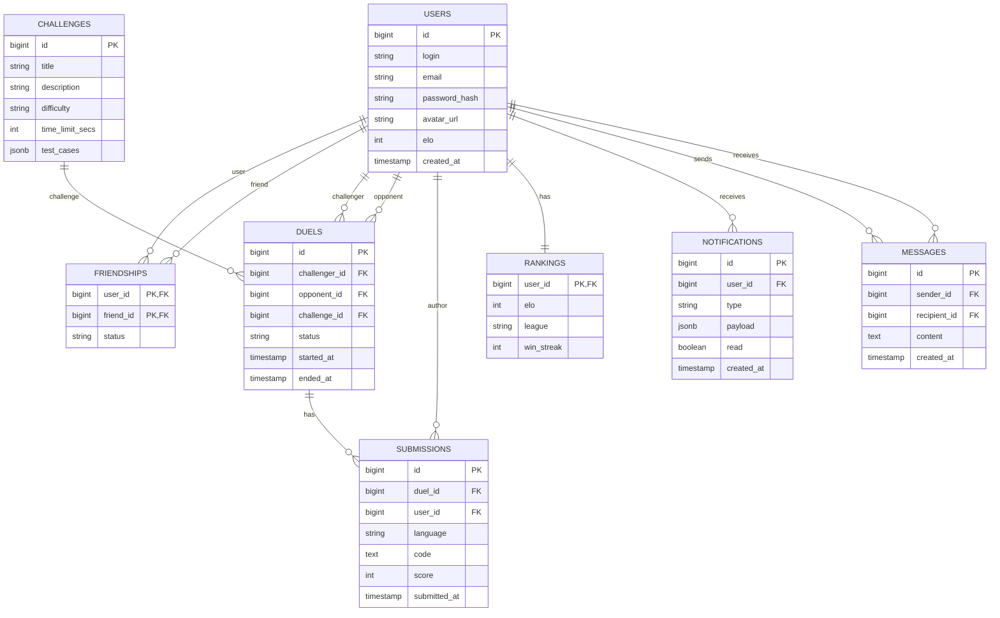

# Database Architecture

This document describes the database schema and architecture for Code Arena.

## Entity Relationship Diagram (ERD)

The following diagram illustrates the core entities and their relationships within the system.

## Schema Management

Schema changes are managed using **Flyway**. All migrations are located in the following directory:
`backend/src/main/resources/db/migration/`

The primary initialization script is:
[V1__init.sql](../../backend/src/main/resources/db/migration/V1__init.sql)
