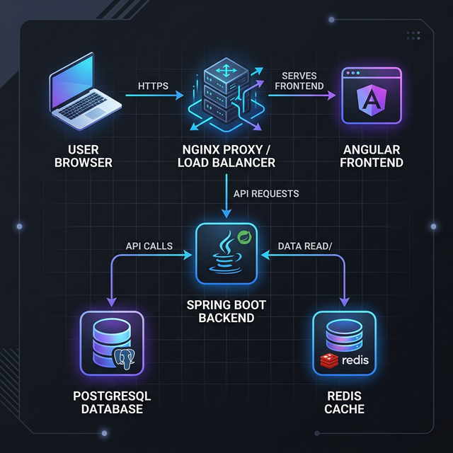
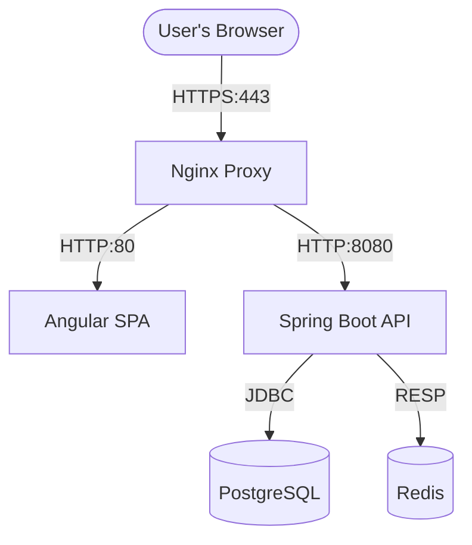

# System Architecture — Code Arena

The Code Arena platform is designed as a microservices-inspired monorepo, utilizing Docker for isolation and standardizing communication via a central Nginx reverse proxy.

## Overview

The system consists of five main components interacting within a virtualized Docker network.

> **Mermaid Diagrams**: VS Code users should install the **"Markdown Preview Mermaid Support"** extension to render diagrams directly in the Markdown preview.

## Component Breakdown

### 1. Nginx Reverse Proxy (`proxy`)
- **Role**: Entry point for all external traffic.
- **Security**: Handles TLS termination (HTTPS).
- **Routing**:
    - Calls to `/` are forwarded to the Frontend.
    - Calls to `/api/*` are forwarded to the Backend.
- **Redirection**: Automatically redirects all HTTP (port 80) traffic to HTTPS (port 443).

### 2. Angular Frontend (`frontend`)
- **Role**: User interface and client-side logic.
- **Internal Server**: Runs a lightweight Nginx instance to serve the static production build.
- **SPA Pattern**: Single Page Application reachable via the root path.

### 3. Spring Boot Backend (`backend`)
- **Role**: Core business logic, authentication, and service orchestration.
- **Framework**: Spring Boot 4.0.3 (Java 25).
- **Connectivity**: Maintains persistent connections to PostgreSQL and Redis.
- **Integration**: Exposes a RESTful API and WebSocket endpoints (planned).

### 4. PostgreSQL Database (`db`)
- **Role**: Persistent storage for user profiles, match history, and challenges.
- **Version**: 18.3-alpine (Postgres 18).
- **Initial Setup**: Uses `init.sql` for schema bootstrapping.

### 5. Redis Cache (`cache`)
- **Role**: Real-time data management.
- **Use Cases**: Matchmaking queue, session caching, and performance optimization.
- **Version**: 8.6.1-alpine (Redis 8).

## Networking

All services communicate over a private Docker bridge network. Service discovery is handled by Docker's internal DNS, allowing services to reference each other by their service names (e.g., `db`, `cache`, `backend`).
